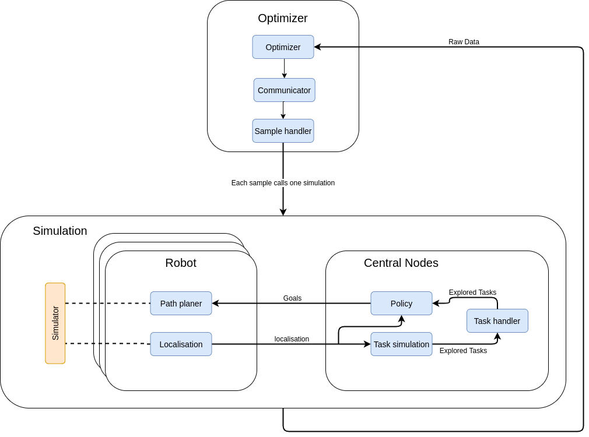
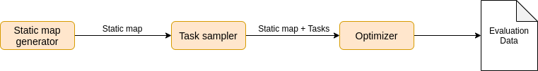

# CPS Adaption Evaluation and Development Framework
for questions: julian.weick@tum.de  
Have Fun!

## Table of contents
* [Short description of the system](#short-description-of-the-system)
* [Features](#features)
* [Architecture](#architecture)
* [Triggerchain](#triggerchain)
* [How to install the usecase](#install)
* [How to run the Use Cases](#run)
* [Problem handling](#problem-handling)
* [Todo](#todo)
* [Example](#example)

## Short description of the system

This repository contains scripts and source codes of a modular framework for smart self-adaptive cyber-physical systems on the example of collaboration robots executing tasks on a map. The software can be used for two purposes:
1. It can be used as the Analyzing and Planing approach of a MAPE-K loop, which is modularized, in which each module able to target specific parts of the context and targets of the CPS. Further, modularization allows for the customization of analyzing and planing on the resources of the system. The modules implemented in the policy are mostly self-adaptive, meaning, that they are changing their behavior during runtime, to adapt to context changes.
2. Since the modules of the policy are representing parts of the context, the implemented system can be used to analyze the importance of self-adaptivity on different parts of the context and the interaction between the robots in the current use case. This helps to develop modules to optimize the adaptivity and system performance for CPS in a changing environment.
For more information on self-adaptivity and the modular concept of the analyzing and planning approach consider the Masters' Thesis "Realization of Adaptive System Transitions for Smart Self-Adaptive Cyber-Physical Systems using a Modular Approach with Learned Parameters on an Example of Multi-Robot Collaboration" form Julian Weick.\\

## Features
The implementation includes:
* Modular Analyzing and Planing approach of a MAPE-K loop for smart-self adaptive cyber-physical systems SSACPS
* Analyzation tool for importantness of adaptation to specific parts of the context
* Noise-free simulator for exact evaluation of performance, context adaptation, and robot behavior
* Policy optimizer based on Bayesian optimization
* Policy optimizer based on genetic algorithms
* Search space reduction module
* Automated map generator
* Automated task generator
* Automated evaluation data generator
* Complete ROS Melodic support on Ubuntu 18,04
* Critical algorithms implemented in cython for performance reasons

## Architecture
### Simplified architecture overview
The simple architecture overview shows the most important parts of the system. It can be broken down into two essential parts. The optimizer, evaluating the interesting sample points from the gathered data, and the simulator, which evaluates the performance of the parameter according to a performance measure.

### Architecture overview

## Triggerchain
To make sure, that every iteration is reproducible and since ROS nodes are by design parallelized, a trigger chain is introduced, making sure, that a ROS node starts working only if it has the necessary OK of the previous ROS node. This ensures the total control of information-flow at all times.

    +-----------+
    | Bayes_opt |
    +-----------+
      |
      V
    +-----------+
    |communicate|
    +-----------+
      |
      V
    +-----------+
    | sample    |
    +-----------+
      |
      V
    +-----------+     +-------------+      +----------------+
    | simulator | --> | map_handler | -->  | task_simulator |
    +-----------+     +-------------+      +----------------+

         A                                          |
         |      Simulation Loop                     |
         |                                          v               
    +-----------+     +-------------+      +----------------+
    | policy    | <-- | map_handler | <--  | task_handler   |
    +-----------+     +-------------+      +----------------+

## How to install the use-case

### Prerequisites
Before setting up and running the use cases make sure that:  
- __ROS__ is installed and running properly. The system is tested on the Melodic version. For the installation of ROS stick to the [official installation instructions](http://wiki.ros.org/melodic/Installation/Ubuntu). Pick the desktop-full or desktop installation. The desktop-full installation should come with Gazebo.
- __Gazebo__ and the required ROS dependencies work will be needed for some parts of the framework.  
   If you installed the desktop-full version of ROS, Gazebo is probably installed as well. If this is not the case, follow the [official documentation](http://gazebosim.org/tutorials?tut=ros_installing&cat=connect_ros).  
   __Important__: We will need some ROS plugins in the Gazebo models, which is why we need the [corresponding ROS package](http://wiki.ros.org/gazebo_plugins): `sudo apt install ros-melodic-gazebo-plugins`.

### Setting up the Use Cases

The system (all parts not only depends on several ROS packages:  

- map\_server  
- turtlebot3  
- ROS navigation stack (Melodic or kinetic release) ( for some parts of the framework)
- exploration\_monitor

#### Setting up the ROS environment and Installing the required packages

1. If the environment hasn't been sourced yet: `source /opt/ros/melodic/setup.bash`
2. Create a catkin workspace e.g.: `~/catkin_ws` with a src directory `~/catkin_ws/src` (or just run : `mkdir -p ~/catkin_ws/src`), go to the catkin folder `cd ~/catkin_ws` and run `catkin_make`
3. Run `source devel/setup.bash`
4. Get the necessary packages. Switch to the corresponding directory `cd ~/catkin_ws/src` and get the source code for the packages:
     - Install the ROS navigation Stack: `sudo apt-get install ros-melodic-move-base-msgs`
     - Install SDL: `sudo apt-get install libsdl-image1.2-dev` and `sudo apt-get install libsdl-dev`
     - Get the Turtlebot resources: `git clone https://github.com/ROBOTIS-GIT/turtlebot3.git` and `git clone https://github.com/ROBOTIS-GIT/turtlebot3_msgs.git`
     - Clone the ma_julian_weick repository
5. Now we have all the required packages; go back to the root of your catkin workspace: `cd ~/catkin_ws`
6. Get all packages' dependencies: `rosdep install --from-paths src --ignore-src --rosdistro melodic -r -y`
7. Build all our packages: `catkin_make -DCMAKE_BUILD_TYPE=Release`. This might take a few minutes the first time and depend on the system.
8. Keep in mind that you have to source the packages: `source ~/catkin_ws/devel/setup.bash`. You can list all available ROS packages with the command `rospack list-names`.
9. Probably change the access rights with `chmod -x` for example `chmod -R 775 ./` if necessary.
10. In `~/catkin_ws` run `catkin_make`
11. We have to change the file `scriptapi.py` to make sure, that no ROS core is required bevor starting Nodes. Change the with -> marked lines:

     def __init__(self):  
         """  
         @raise RLException: if fails to initialize  
         """  
         import rosgraph.masterapi  
         master = rosgraph.masterapi.Master('/roslaunch_script')  
         -> uuid = roslaunch.rlutil.get_or_generate_uuid(None, False)   # was: uuid = roslaunch.rlutil.get_or_generate_uuid(None, True)  
         -> self.parent = roslaunch.parent.ROSLaunchParent(uuid, [], is_core=True)      #was: self.parent = roslaunch.parent.ROSLaunchParent(uuid, [], is_core=False)  
         self.started = False  

#### Additional packages for python3

The Software has been ported to python3. Make sure that python3 is installed (`python3 --version`) and that pip3 is installed (`sudo apt install python3-pip`) and available in the latest version. To update pip use `pip3 install --upgrade pip`. The following packages have to be installed:
* zmq: `pip3 install zmq`
* psutil: `pip3 install psutil`
* matplotlib: `pip3 install matplotlib`
* skopt: `pipe install scikit-optimize`
* defusedxml: `pip3 install defusedxml`
* rospkg: `pip3 install rospkg`
* sklearn: `pip3 install sklearn`
* PIL: `pip3 install pillow`
* imageio: `pip3 install imageio`
* empy: `pip3 install empy`
* scikit-image: `pip3 install scikit-image`
* netpbmfile: `pip3 install netpbmfile`

If you want to install all of them:
`pip3 install zmq psutil matplotlib scikit-optimize defusedxml rospkg sklearn pillow imageio empy scikit-image netpbmfile`

## How to run the Use Cases
Before running the use-case, make sure you have installed the required packages for the simulation. There are three different optimization possibilities. For all of them you need to initialize a terminal:

1.  Open a terminal window.
2.  go to the catkin folder `cd catkin_ws/...`
3.  Specify the Turtlebot 3 model: `export TURTLEBOT3_MODEL=burger`
4.  Source the file: `source devel/setup.bash`

Note that you need to make sure, that in the folder `mrs/packages/Simulation_Data`, the `exploration_tasks.txt`,`static_map.pgm` and `Tasks.txt` has to be specified.
Further note, that you may have to change the imports in the Bayes_opt file according to the intructions given in the code.

The __RESULTS__ can be found in the folder `mrs_packages/Opt_data` and `mrs_packages/raw_data_output`. Check the corresponding readme of the mrs_packages folder for more informantion

### Evaluation of the perfromance.

Sepecify the neccecary parameter and uncomment the function `evaluate_performance()` in `Bayes_Opt.py` and specify the parameter in `parameter_handler.py`. Then run: `python3 Bayes_Opt.py`.
The resulting performance value is printed on the screen. If more then one parameter array is tested, the output has to be adapted accordingly.
#### Parameter
* `num_of_solution_samples` Determines the number of sample which are executed during one iteration.
* `num_of_parrallel_executed_solution_samples` Determines the number of samples, which are executed in parrallel.
* `Number_iter_next_sample` Determines how many iterations the simulation of each sample is supposed to have.
* `param` 2D array with the parameters to check. Note that the num_of_solution_samples has to fitt the number of parameter vectors in this array.

### Bayesian Optimization
This optimizer uses a Bayesian optimization approach, to optimize the (hyper) parameter. It is based on scikit-optimize https://scikit-optimize.github.io/stable/modules/classes.html . To run this use case go in the `mrs_peripherals` folder,
Specify the conditions in the files `Bayes_Opt.py` and `parameter_handler.py` respectively, uncomment the function `Bayes_optimize()` and start the Optimization: `python3 Bayes_Opt.py`

#### Parameter:
##### Optimization parameter:
* `num_of_solution_samples` Determines the number of sample which are executed during one iteration.
* `num_of_parrallel_executed_solution_samples` Determines the number of samples, which are executed in parrallel.
* `Number_iter_next_sample` Determines how many iterations the simulation of each sample is supposed to have.
* `Bayes_iterations` Determines the number of iterations of the Bayesian optimization. One iteration processes num_of_solution_samples many samples
* `Initial_random_samples` Determines the number of randomly sampled points to initialize the surrogate model of the Bayesian approach
* `Maximize` If false, the algorithm searches the minima, if true, the performance measure is negated resulting in searching the maximum. Note that the performance values are now all minus

### Genetic Algorithm
As a second option to optimize (hyper) parameter, a genetic algorithm is foreseen. It is implemented in the folder `mrs_peripherals/code` as `GA.py`, but has never been used or tested

### Line search
We have programmed a "line search" like an algorithm to reduce the dimension of the search space. To run the use case, uncomment the function `run_parameter_space_exploration()` and specify the corresponding parameters in the files `Bayes_Opt.py` and `parameter_handler.py`.
More information on the principle of this procedure can be found in the thesis: "Realization of Adaptive System Transitions for Smart Self-Adaptive Cyber-Physical Systems using a Modular Approach with Learned Parameters on an Example of Multi-Robot Collaboration" by Julian Weick.

#### Parameter

* `num_of_solution_samples` Determines the number of solution sample which are executed during one iteration
* `num_of_parrallel_executed_solution_samples` Determines the number of solution samples, which are executed in parrallel. 
* `Number_iter_next_sample` Determines how many iterations each sample solution is supposed to have
* `Optimal_parameter_list` Start from where the search is starting
* `iterations` Number of iterations, the line search procedure should compute

### Automated data generation

An automated data generation script called `Data_generator.py` is implemented and shown in the figure .
The generator consists of three parts:
1. A Static map generator, which automatically generates walls and obstacles using a predefined pool of shapes, and making sure, that the robot can access the whole map. More information can be found in the README in /room_generator.
2. A Task sampler, which generates spatial and temporal information for tasks according to a specified distribution.
3. The Optimizer Bayes_Opt.py, which evaluates the optimal (hyper)Parameter.
Note that you may have to change the imports in the Bayes_opt file according to the intructions given in the code to run the automated data generator.
#### Variables on the Automated data generator
Since there is no other README for the automated data generator, we will introduce the variables here.

* `Activate_map_generator` If activated automatic maps are generated. If not, maps are taken form the folder /Maps
##### Data generation parameter

* `No_of_maps` Number of maps which are being processed. If the maps are taken from the /Maps folder, they have to be numerated (0.pgm, 1.pgm...)
* `No_of_task_distr`  Number of different task distributions for each map. Total experiments: No_of_maps*No_of_task_distr

##### Room parameter:
* `map_length` Number of pixels the quadratic map is in size
* `occupancy` Specifies, how much of the map is occupied by rooms or obstacles (1 = full occupancy)
* `max_size_obstacle` Maximum size of the obstacles, the largest shape currently implemented is 200*200

##### Exploration task sampler parameter
The exploration task sampler generates exploration tasks on a specific map. There are two possible ways to sample exploration tasks:
1. Random sampling
2. Sampling according to importance. The importance is reverse proportional to the visibility of the corresponding exploration task. This ensures the sampling in badly visible areas because if an area contains no exploration task, they are can not be explored by purpose.
* `NO_OF_TASKS_U` Total number of exploration tasks to be generated randomly
* `NO_OF_TASKS_G` Number of exploration tasks to be generated according to the importance
* `radius` Radius of importance around the obstacles. Note, that a large radius will take a lot of time to compute.
* `obstacle_treshold` Determines the number of neighbors needed in an obstacle to not be considered. Otherwise, large obstacles would have high importance.

##### Task sampler parameter 
Note that the time measure is iterations in the simulator node if the custom simulator is used.
###### Gaussian tasks:
These parameters are for the sampling process of (spatial) gaussian tasks.
* `manual_tasks` If true, manual defined distributions are used (Always sampled from the same parameter)
* `maximum_time` Time when the last task is allowed to be sampled (near end of simulation)
* `maximum_time_intervall` Maximum time between the tasks are sampled in the same spot
* `maximum_no_of_tasks` Maximum number of tasks sampled from one task distribution (one Gaussian distribution for example)
* `max_task_per_t` Maximum number of tasks, which can be sampled at the same time 
* `number_of_gauss_tasks_min` Minimum total number of tasks drawn by all Gaussians combined. (It will be drawn slightly more than that. Its the break-up point)
* `number_of_gauss_tasks_max` Maximum total number of tasks drawn by all Gaussians combined. (It will be drawn slightly more than that. Its the break-up point)
* `max_equal_distriburion_number` Maximum Number of equal distributions at different times, meaning from one distribution, tasks are sampled at different times. 

* `max_variance` Maximum variance of the distributions.

###### Uniform distributed tasks
* `number_of_uniform_tasks_min` Minimal total number of uniform distributed tasks to be generated
* `number_of_uniform_tasks_max` Maximal total number of uniform distributed tasks to be generated

##### Optimization parameter:
* `num_of_solution_samples` Determines the number of sample which are executed during one iteration.
* `num_of_parrallel_executed_solution_samples` Determines the number of samples, which are executed in parrallel.
* `Number_iter_next_sample` Determines how many iterations the simulation of each sample is supposed to have.
* `Bayes_iterations` Determines the number of iterations of the Bayesian optimization. One iteration processes num_of_solution_samples many samples
* `Initial_random_samples` Determines the number of randomly sampled points to initialize the surrogate model of the Bayesian approach
* `Maximize` If false, the algorithm searches the minima, if true, the performance measure is negated resulting in searching the maximum. Note that the performance values are now all minus

#### Results of the Automated data generation

In the folder `Optimization_data`, for each experiment, one map (static features of the map, generated by the room generator). For documentation purposes, a folder of the structure Single_map_Optimization_"Map_name" is initialized. This folder holds the files:

* out.txt: holding the tasks (dynamic map features) with the format [x-coorinate, y-coordinate, spawn time] in every row.
* map.pgm: holding the room (static map features) as pgm file
* exploration_tasks.txt: Holds the exploration tasks used in this experiment [x, y, Not used]
* Exploration_task_liklehood: Shows the likelihood figure used to generate the exploration tasks
* _ConvergencePlot_figure: Convergence plot of the experiment
* _ConvergencePlot: Data to generate the convergence plot
* _Bayes_raw_data: In the first row, the best performing parameters, after that the performance, followed by the parameters [Policy_NORM_SURROUND_EXPLORATION, Map_Handler_ALPHA, Policy_NORM_CLUSTER, Policy_NORM_SURROUND, Policy_NORM_ENTROPY, Policy_EXPLORATION_DISTANCE_BONUS, Policy_NORM_EXPLORATION]\\

Besides that, a folder called `raw_simulation_data` holds the raw simulation data for each sample candidate, namely `candidate_x_y_ID`, with x being the experiment number (which static map), y being the optimization iteration number, and ID being the corresponding ID in this iteration number. Note, that one iteration has `num_of_solution_samples` many candidate IDs.\\
The raw data consists of [x_robot1, y_robot1, x_robot2, y_robot2, #_Discovered_tasks, #_Undiscovered_tasks] in every row (one row = one simulation step).

### Evaluation of the performance

The script `Bayes_Opt.py` contains the function `evaluate_performance()`, which enables the evaluation of the performance of the given parameter. Note that for the evaluation of different parameters than specified in the Thesis, the for loop has to be modified. 

More information on the corresponding options can be found in the README in the mrs_peripherals folder.

__IMPORTANT__: You need to source the ROS and catkin setup files (in each terminal window). If you followed the standard ROS configuration, you already added the command (`source /opt/ros/melodic/setup.bash`) to your .bashrc and only have to `source ~/catkin_ws/devel/setup.bash`. And don't forget to select the turtle bots with: export TURTLEBOT3_MODEL=burger.

## Problem handling

### Samples does not start (probably after ROS update) ERROR: Unknown error initiating TCP/IP socket to "Computer name"
Check again the file `scriptapi.py` to make sure, that no ROS core is required bevor starting Nodes. Change the with -> marked lines:

     def __init__(self):  
         """  
         @raise RLException: if fails to initialize  
         """  
         import rosgraph.masterapi  
         master = rosgraph.masterapi.Master('/roslaunch_script')  
         -> uuid = roslaunch.rlutil.get_or_generate_uuid(None, False)   # was: uuid = roslaunch.rlutil.get_or_generate_uuid(None, True)  
         -> self.parent = roslaunch.parent.ROSLaunchParent(uuid, [], is_core=True)      #was: self.parent = roslaunch.parent.ROSLaunchParent(uuid, [], is_core=False)  
         self.started = False  

### Does not run

- If the system does not run, try to rebuild with "catkin_make" in the catkin folder.
- If the socket communication produces an error restart the system.

### Path can not be found.

- The A* algorithm needs to find a path ( which it finds, if there is any). Therefore make sure, that the task is reachable for the robots.

## Todo

- [ ] Exception handling for maps, which are partially not accessible
- [ ] Rework the Map generator to not relay on predefined shapes, for more variety.
- [ ]  Investigate the influence of more than two robots on the behavior of the system
- [ ]  Implementation of more policy modules dealing with the time of task spawning, how long it takes to execute a task, task importance, defining regions of higher importance e.t.c. Development of the corresponding performance measures
- [ ]  Revision of code and development of a flexible framework with gazebo integration e.t.c including exception handling and centralization of shared components
- [ ]  Change of policy distance function from euclidean to path planned by the path planner
- [ ]  Decentralize the policy
- [ ]  Program heavily used parts in Cython or C++ (Raytrace, map handling, task evaluation, policy...).
- [ ]  Evaluate the possibility to define a set of setups and learn the optimal hyper-parameter according to machine learning standards with the training set, test set, and validation set
- [ ]  Build a feedback loop system out of the automated experiment. The idea is to extend the map generator in a way, that the produced maps are minimizing the performance of the policy with the hyper-parameter at the current state comparable to a Generative Adversarial Network (GAN). The result would be a system highly suitable for the evaluation of the interaction between behavior patterns and the interaction between behavior patterns and the context for research purposes
- [ ]  Implement the learning algorithm as a run time solution, capable of optimizing the hyper-parameter during the system's execution time
- [ ]  Transfer the implementation to a container to be able to run it on large external server hardware.
- [ ] Replace the timing_watchdog by a watchdog, which communicates with the corresponding simulation and actively monitors the process status.
- [ ] Put effort in propper software testing.

## Known Bugs/Hacks

- Occationaly problems with saving `/mrs_packages/Opt_data/task_data_XXXX` in the simulator node. We made a quick and dirty hack in line 57 in Bayes_Opt, to avoid problems in this prototype.
- Occationaly the trigger chain gets stuck. We therefore programmed a watchdog to reinitiate the trigger chain.
- The socket communication is hard coded and therefore is prune to produce errors if a socket is not closed correctly.
- The Bitmap visualizer is not included in the trigger chain. The bitmaps are therefore not neccecarily temporal comparable. 
- Occationaly the A* pathplaning fails for no obvious reason.

## Output folders

### mrs_packages/Opt_data
This folder holds the data used in the optimization process, and the performance value:
* `task_data_xxxx :` contains the performance of the respective task in the format:\\ [performance_mean, performance_median, performance_variance, performance_mean_discovered_tasks, performance_mean_undiscovered_tasks, performance_median_discovered_tasks, performance_median_undiscovered_tasks, performance_variance_discovered_tasks, performance_variance_undiscovered_tasks]
8 `parameter_mapping :` This folder contains all data generated if Bayes_opt is perfroming the mapping of the parameter space using the function run_parameter_space_exploration(). It therefore holds the optimal values of the corresponding parameters in the files: 
- `Optimal_performance_parameterX`, where in every row one parameter is optimized, while the others are static. Format [param1, param2,...] and each row represents the optimal parameter of the corresponding batch.
- `task_parameter_list_for_batch_x_parameter_y`, containing the parameter of each sample, with the non-static parameter y in the corresponding batch x. Same Format as Optimal_performance_parameterX, except that each row represents one simulation iteration.
- `task_performance_list_for_batch_x_parameter_y`, containing the performance of each sample, with the non-static parameter y in the corresponding batch x. Same format as task_data

### mrs_packages/raw_data_output
This folder contains the raw simulation data. In the folder Simulation_output two files are containing the raw data:
* `candidate_xxxx :` Holds the raw data, needed to recunstruct the simulation. The data has the format: [x_robot1, y_robot1, x_robot2, y_robot2, #_Discovered_tasks, #_Undiscovered_tasks]

## Data Visualisation

For data visualization, the matplotlib is used. A script with some code snippet used in the thesis is located in `mrs_packages/Support_skripts`
