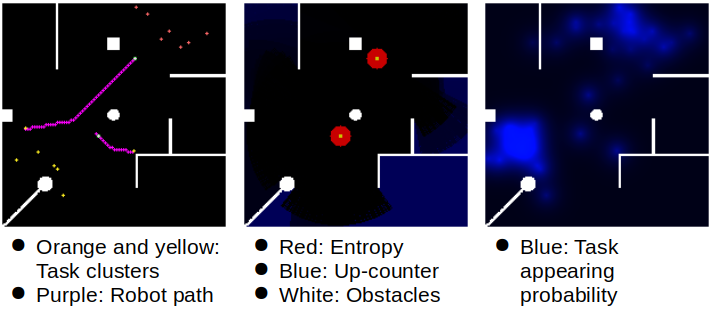

# MRS_packages

This folder contains the ROS Nodes and the filed and data used and produced by the ROS Nodes. Note, that the `policy` has its own sub-readme, with a deeper explanation.

## ROS Nodes

### goal_communicator

#### Function
This node is the interface between the policy and the move base node of the implemented system. It provides the next goal to the
move base, which it gets from the policy and can abort the robots movements if needed.

#### Communication
##### Receives Messages
* `GoalCoordinates :` Goal coordinates for each robot

##### Sends Messages
The coordinates are transfered to the move_base via a ROS action client (https://docs.ros.org/diamondback/api/actionlib/html/classactionlib_1_1SimpleActionClient.html).
### map_handler

#### Function
The map handler node receives the obstacle layout from the parameter ’Grid_map’.
The map handler keeps two grid maps, the exploration counter, and the probability accumulation. The
sizes of these grids are determined by the SIZE variable. So, the obstacles can be represented as a grid map without losing
any information. Each cell of the exploration counter is initialized to zero, while each cell of the probability
accumulation is initialized uniformly.

```math
initial\_probability\_of\_a\_cell = \frac{1}{empty\_cell\_count}
```
The map handler gets the robot locations from the `/tb3 0/amcl` pose and `/tb3 1/amcl` pose topics. Its
operations do not start until it has received a message from both of these topics. Map handler is also
subscribed to the explored task topic, from which explored and conflict-free tasks are received. These tasks
are kept in a list at the map handler. Each time a new task is received, the probability accumulation grid map
is updated. A new task increases the probability of new task appearance in its surrounding cells. The radius
of this effect is determined by the parameter prob_effect_radius. The effect of new tasks on the probability
of surrounding cells is exponentially decaying with the distance.
Probability update: First, we create a matrix of ones with the size equal to the size of the probability
accumulation grid map. On this map, cells that lie outside of the effect radius are set to zero. For each cell
within the probability effect radius, we set the cell’s value to:
```math
(prob\_effect\_radius − distance\_to\_new\_task)^7 
```
Then we normalize this matrix, add it to the probability accumulation matrix, and normalize the probability
accumulation matrix one last time. This gives us the updated probability accumulation.
Whenever a robot moves, the map handler scans the list of tasks and removes the tasks if they are within
a certain radius of a robot. This radius is defined by the parameter broom size. The obstacles are of course
considered.
At each iteration, the map handler does the following:
1. Publish the grid maps of obstacles, exploration counter, and probability accumulation.
2. Publish the current task list.
3. Publish current robot locations.
4. Update the exploration counter grid map: Set the cell’s value to zero if a robot can see it, add 1 to the
cell’s value otherwise. The obstacles are of course considered.

#### Communication

##### Receives Messages
* `/trigger_map_handler :` The trigger from the simulator
* `/tb3_0/amcl_pose :` Pose of the first robot.
* `/tb3_1/amcl_pose :` Pose of the second robot.
* `/explored_task :` list with all explored tasks
##### Sends Messages
* `/robot_location :` 
* `/grid_maps :` A first layer contains the
observed probabilities of tasks at each cell of the grid and a second layer containing a counter. This counter is incremented at each timestep if the corresponding cell is not in the view of any of the robots. As soon as a cell comes into view again, the counter is reset to zero. All in all, the GridMap holds the aggregated knowledge gained by all observations made so far, in the form of the task probabilities.
* `/discovered_tasks :` list with all discovered (explored) tasks
* `/trigger_policy :` trigger to let the policy run one iteration.

#### Parameters

*  `SIZE`: Size of the map (map is assumed to be square).
*  `PUBLISH_FREQUENCY`: Frequency (in seconds) to publish grid maps and task list, and to count the exploration of the cells.
*  `broom_size`: How close the robot should be to dirt to clean it.
*  `prob_effect_radius`: When dirt appears in a location, this increases the probability of dirt appearing in a circular area surrounding it. This is the radius of that area.
*  `radius`: Detection radius, for both robots.
*  `ALPHA`: Weight of old probabilities in relation to the newly appearing task.

### Policy

The policy is described in detail in the readme located in the policy folder.

### Simulator

The simulator node is developed as a replacement for the gazebo simulation environment. The motivation hereby was to create a simulator that has a deterministic (and reproducible) behavior for the path planning and the robot localization. Further, it should be not as computationally demanding as the gazebo simulator.

#### Function

The simulator is a ROS node, providing a discretizised simulation environment, enabling multiple agents to interact with appearing tasks and static obstacles. A location service for each robot is implemented, which is able to locate the robots exactly if needed, or blur the real location by sampling from a specified distribution with the location as expected value:

```math
\begin{bmatrix} X_{AMCL} \\ Y_{AMCL} \\ \varphi_{AMCL} \end{bmatrix} ~=~ \begin{bmatrix} X_{loc} \\ Y_{loc} \\ \varphi_{loc} \end{bmatrix} + \begin{bmatrix} \epsilon_{x} \\ \epsilon_{y} \\ \epsilon_{\varphi} \end{bmatrix}
```

with 

```math
\begin{bmatrix} \epsilon_{x} \\ \epsilon_{y} \\ \epsilon_{\varphi} \end{bmatrix} \sim  \begin{bmatrix} N(\mu_{x},\sigma^2_{x}) \\ N(\mu_{y},\sigma^2_{y}) \\ N(\mu_{\varphi},\sigma^2_{\varphi}) \end{bmatrix}
```

using the exact location and direction $`X_{loc} , Y_{loc} , \phi_{loc} `$ with an offset $` \mu `$ and the spread $`\sigma`$.\\
The simulator also includes a motion planning component. For this purpose, a A* search algorithm is implemented in cython language for performance reasons. This algorithm ensures a deterministic behavior of the motion planer due to its properties of completeness and optimality. The simulator designed allows a native implementation of most of the planning algorithms provided by the Python Robotics project by Atsushi Sakai under https://github.com/AtsushiSakai/PythonRobotics. Note though that these algorithms are implemented in python and therefore offer a bad computational performance especially on large maps.

#### Communication
##### Receives Messages

* `/grid_maps :` A first layer contains the
observed probabilities of tasks at each cell of the grid and a second layer contain a counter. This counter is incremented at each timestep if the corresponding cell is not in the view of any of the robots. As soon as a cell comes into view again, the counter is reset to zero. All in all, the GridMap holds the aggregated knowledge gained by all observations made so far, in the form of the task probabilities.
* `/discovered_tasks :` List with discovered tasks
* `/undiscovered_tasks_simulation :` list with undiscovered tasks for the simulation
* `/trigger_next_iteration_watchdog :` Trigger from the watchdog. If the watchdog detects the simulation iteration to run for more than the time threshold, the simulator is triggered.
* `/trig_sim :` Regular trigger from the policy
* `/name/GoalCoordinates :` Goal coordinates from the policy for each robot with the corresponding "name"

##### Sends Messages

* `/undiscovered_task_request2 :` Request message, to the task simulator, which triggers the message undiscovered_tasks_simulation.
* `/name/amcl_pose :` The coordinates and orientation of the robots on the map.
* `/name/path_list :` The path list for the corresponding robots.

### task_handler

#### Function
The TaskHandler’s main purpose is to resolve any type of conflict in the two robots’ observations. As long as
the detection radii of the two robots do not intersect, the TaskHandler can simply propagate any observation
made to the maps. However, if the robots come sufficiently close, their sensors will perceive the same task.
As with any physical measurement, the localization of the task is not error-free and hence the two robots will
localize the same task at least slightly different locations. If nothing is done, there will be two distinct
instances of tasks reported to maps, which is of course nonsensical.
In order to resolve that issue, our TaskHandler will propagate the average of both observations to the
maps in this case.
Likewise, we need to make sure that re-observations of the same task do not get propagated to the map
at slightly different locations. This is achieved by only counting task as a new task if is separated from the
existing task by a sufficiently large distance. This threshold distance depends on the accuracy of the sensors
and needs to be finetuned on the hardware.

#### Communication
##### Receives Messages
* `/robot_location :` 
* `/explored_task_simulation :` A list, which holds the tasks, explored by the task simulator in the current simulation iteration.
* `/trigger_policy_simulation :` Trigger signal to the policy


##### Sends Messages

* `/trigger_map_handler :` Trigger from the map handler
* `/explored_task :` List with explored tasks
* `/robot_location_simulation :` robot location for the task simulator (simulation because the task_simulator simulates the sensor)
#### Parameters
*  `equaltaskthreshold`:  Distance threshold below two tasks are merged to one by averaging the position

### task_simualtor

#### Function
The task simulator node is meant to distribute new tasks on the map with a given rate, and given
distribution. We want to make a difference between explored and unexplored tasks. The idea is that the
task simulator will provide an unexplored task on the map. As soon as the task handler will declare the task
as explored task, it will be marked so. Unexplored tasks can not be seen by robots. Explored tasks are
visible for both robots(shared knowledge base). If a robot executes a task it will get deleted for both. Besides
that, the task simulator node will simulate the sensor behavior. There are three errors to simulate:
* False positive error of detecting a task
* False negative error of detecting a task
* Position uncertainty of a task
With the ability to adjust these errors freely we are planning to investigate the influence of different
sensor characteristics on our algorithm.

#### Communication
##### Receives Messages
* `/robot_location_simulation :` The robot location from the task_handler (simulation because the task_simulator simulates the sensor)
* `/undiscovered_task_request :` Requesting the publishing of a undiscovered task
* `/undiscovered_task_request2 :` Requesting the publishing of a undiscovered task

##### Sends Messages


* `trigger_policy_simulation :` Triggering the policy if finished.
* `explored_task_simulation :` List containing the explored tasks
* `/undiscovered_tasks_simulation :` List containing the unexplored tasks for the simulator
* `/undiscovered_tasks_bitmap :` List containing the unexplored tasks for the bitmap visualizer


#### Parameters
*  `detectionradius`: Is fetched from the task handler via the topic robotlocationsimulation, which fetches it from the map handler node via the robot location topic.
*  `wallhack`:  If it is true the robot can detect dirt true walls, but it can not clean true walls
*  `FNrate`:  Probability, that dirt will not be detected, even if it is in detection range.
*  `FPrate`:  Probability, that dirt will be detected even if there is no dirt.
*  `sensornoisesigmax`:  Sigma of a Gaussian distribution for the simulation of the position noise of the sensor in the x-direction
*  `sensornoisesigmay`:  Sigma of a Gaussian distribution for the simulation of the position noise of the sensor in the y-direction
*  `sensortolerance`: If True the sensor will have the tolerance Sigma specified.  If False the sensor is perfect in terms of noise


### watchdog

#### Function
The watchdog monitors the correct function of the trigger chain described in the overall Readme. A threshold called `time_to_trigger_reset` is defined in the watchdog node, after which, if the trigger chain has not reached its start point again (one simulation iteration), the watchdog will trigger the simulator to initialize a new simulation iteration.\\
Note that in the current version, the watchdog is not used, but a watchdog is implemented directly in the Bayes_opt.

#### Communication
##### Receives Messages

* `/triger_next_iteration :` Message indicating the finish of one iteration in the trigger chain (one simulation iteration)
* `/tb3_0/amcl_pose :` Possition and orientation of the first robot
* `/tb3_1/amcl_pose :` Possition and orientation of the second robot

##### Sends Messages
* `/triger_next_iteration_watchdog :` If the trigger chain is stuck, this message will initiate it again.

### Support_skripts
This folder contains the script to support the simulation and evaluation of the resulting data.
#### Data Visualisation

Holds code snippets used for data visualization. More information on the visualization used are available at https://matplotlib.org/contents.html.

### Simulation_Data

The simulation Data folder holds the files needed to conduct a simulation/parameter optimization. It holds 3 items, which have to be placed there manually in case of Bayes_opt in the folder `mrs_peripherals` is used. 

* `exploration_tasks.txt :` File holding the exploration tasks for the policy. Every row represents an exploration task with the position: x,y
* `static_map.pgm :` The map, the robots should operate in as a .pgm. Note, that this map has to be quadratic and that the whole map has to be accessible for the robots in the current version.
* `Tasks.txt: ` Holding the tasks on the map in the format x_position,y_position,spawn_time

### shared_skripts
This folder holds `nodes_utils.py`, which consists of several functions, which are shared by several nodes. If the (runtime) performance of the software should be increased, it might make sense to start here (e.g. considering writing the raytracing function in C++ or Cython).

### parameter_setter
The parameter setter reads in a list of parameters and loads it into the parameter server. It is not in use in the current version.

### Opt_data
This folder holds the data used in the optimization process, and the performance value:
* `task_data_xxxx :` contains the performance of the respective task in the format:\\ [performance_mean, performance_median, performance_variance, performance_mean_discovered_tasks, performance_mean_undiscovered_tasks, performance_median_discovered_tasks, performance_median_undiscovered_tasks, performance_variance_discovered_tasks, performance_variance_undiscovered_tasks]
8 `parameter_mapping :` This folder contains all data generated if Bayes_opt is perfroming the mapping of the parameter space using the function run_parameter_space_exploration(). It therefore holds the optimal values of the corresponding parameters in the files: 
- `Optimal_performance_parameterX`, where in every row one parameter is optimized, while the others are static. Format [param1, param2,...] and each row represents the optimal parameter of the corresponding batch.
- `task_parameter_list_for_batch_x_parameter_y`, containing the parameter of each sample, with the non-static parameter y in the corresponding batch x. Same Format as Optimal_performance_parameterX, except that each row represents one simulation iteration.
- `task_performance_list_for_batch_x_parameter_y`, containing the performance of each sample, with the non-static parameter y in the corresponding batch x. Same format as task_data

### bitmap_visualizer
#### Function
This node is subscribed to almost every topic. It gets the discovered and undiscovered tasks, the clustered tasks, the entropy of the system, robot locations, probability distribution, observation up-counting, and of course the obstacle layout. In certain intervals, this node saves a 'bitmap', a .png file that visualizes the state of the simulation. Each bitmap has three frames optimized for 200x200 pixel maps. Each frame has the obstacles drawn. This node also saves the number of total (discovered and undiscovered) tasks on the map into a text file, according to the same pre-determined frequency.

The first frame additionally has the robots depicted as green squares. The tasks are also shown in this frame. Undiscovered tasks are gray, and discovered tasks' colors are determined by their clusters. The cluster assignments and therefore the colors assigned to each task will change frequently, but the important thing is that the tasks that belong to the same cluster are depicted with the same color. The tasks disappear once they are fulfilled.

In the second frame, we see the probability heatmap as perceived by our approach. The probability values calculated by the map_handler are multiplied with constants that give meaningful pixel values and are shown directly on this frame of the bitmap.

In the third frame, we see which regions have not been observed for a long time. As time goes by unobserved regions become a brighter blue, while recently observed regions immediately go back to black. In this frame, we see the robots again. We also see the effect of entropy on the robots' decisions. This effect is depicted via the red circles around the robots. The radii of these circles are determined to the entropy of discovered tasks on the map. Again, this value is not directly used but instead summed with 3 and taken to the power of 2, to give a nice visual.

#### Parameters

*  `VISUALIZE_FREQUENCY`: Frequency (in seconds) to create and save the bitmap to visualize the state of the system.

#### Communication
##### Receives Messages
* `/robot_location :` 
* `/grid_maps :` Grid maps containing the up-counter, the position of the robots, and the obstacles.
* `/discovered_tasks :` List with the discovered tasks
* `/undiscovered_tasks_bitmap :` List with the undiscovered tasks
* `/entropy :` Entropy repulsion force of the robots.
* `/clustered_tasks :` Tasks with their individual clusters
* `/tb3_0/path_list :` List containing the path of robot 0
* `/tb3_1/path_list :` List containing the path of robot 1


##### Sends Messages
None

### bitmap_scripts

There are two scripts we used that are worth mentioning in detail. One is gif_creator.py, which is a very short script that uses the imageio library to combine given images into a gif. We used this script to animate the bitmaps that were generated by the bitmap_visualiser node. The second script is sampling_test_clusters.py, which was used to generate the task distributions we used for testing.

sampling_test_clusters.py creates several clusters of tasks, each cluster generated according to the Gaussian distribution. The user has to specify the number of clusters. Then for each cluster, they have to specify:

* `mean (x and y):` coordinates of the center of the cluster
* `variance (x and y):` variance of the Gaussian distribution in the x and y directions
* `start_time:` at which time step should the cluster begin to appear
* `time_interval:` how often the cluster should appear
* `no_of_samples:` how many tasks are in the cluster
* `samples_per_t:` how many tasks should appear at once

With this information, a text file is generated where each line specifies a different task. Each task is determined by three numbers: x, y, time of appearance.

Other small scripts we used to create test cases and to evaluate and visualize results can be found in our GitLab repository with their explanations. These scripts were used for simple tasks such as combining images, blacking out certain parts of an image, changing formats of text files, visualizing the task distribution in a given text file, etc.

### raw_data_output
This folder contains the raw simulation data. In the folder Simulation_output two files are containing the raw data:
* `candidate_xxxx :` Holds the raw data, needed to recunstruct the simulation. The data has the format: [x_robot1, y_robot1, x_robot2, y_robot2, #_Discovered_tasks, #_Undiscovered_tasks]